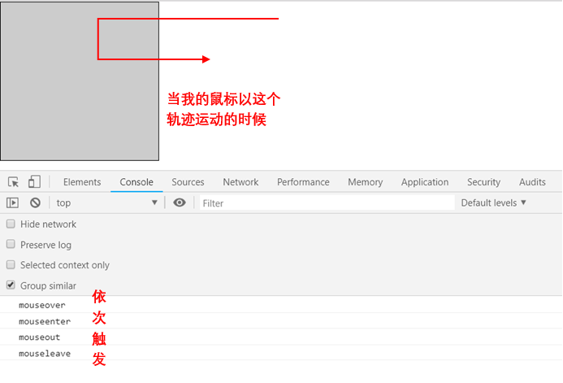

# 细说mouseenter和mouseover，mouseout和mouseleave的区别
## 介绍（MDN）
**mouseenter**：当指针设备移动到存在监听器的元素或其子元素的时候，mouseover事件就会被触发。
**mouseover**：当定点设备（通常指鼠标）移动到元素上时就会触发 mouseenter 事件

**mouseout**：事件在当指针设备（通常是鼠标）移出了附加侦听器的元素或关闭了它的一个子元素时触发。
**mouseleave**：指点设备（通常是鼠标）的指针移出某个元素时，会触发mouseleave事件。
## 执行顺序
```
<div></div>
<script>
    var div = document.getElementsByTagName('div')[0];
    eventBind(div, 'mouseenter', 'mouseenter');
    eventBind(div, 'mouseover', 'mouseover');
    eventBind(div, 'mouseout', 'mouseout');
    eventBind(div, 'mouseleave', 'mouseleave');
    function eventBind(ele, event, output){//简单封装个绑定函数
        ele.addEventListener('event',function(){
            console.log(output);
        })
    }
</script>
```
