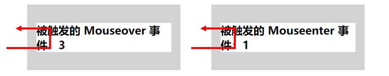

# 细说mouseenter和mouseover，mouseout和mouseleave的区别
## 介绍（MDN）
**mouseover**：当指针设备移动到存在监听器的元素或其子元素的时候，mouseover事件就会被触发。
**mouseenter**：当定点设备（通常指鼠标）移动到元素上时就会触发 mouseenter 事件

**mouseout**：事件在当指针设备（通常是鼠标）移出了附加侦听器的元素或关闭了它的一个子元素时触发。
**mouseleave**：指点设备（通常是鼠标）的指针移出某个元素时，会触发mouseleave事件。
## 执行顺序
```
<div></div>
<script>
    var div = document.getElementsByTagName('div')[0];
    eventBind(div, 'mouseenter', 'mouseenter');
    eventBind(div, 'mouseover', 'mouseover');
    eventBind(div, 'mouseout', 'mouseout');
    eventBind(div, 'mouseleave', 'mouseleave');
    function eventBind(ele, event, output){//简单封装个绑定函数
        ele.addEventListener('event',function(){
            console.log(output);
        })
    }
</script>
```

## 触发条件
按照**介绍**中给出的定义
不论鼠标指针穿过被选元素或其子元素、孙元素，都会触发mouseover事件
只有鼠标指针穿过被选元素时，才会触发mouseenter事件

```
    <div>
        <h2>被绑定的<span class="eventType"></span>事件被触发<span class="count">0</span></h2>
    </div>
    <div>
        <h2>被绑定的<span class="eventType"></span>事件被触发<span class="count">0</span></h2>
    </div>
    <script>
        var div = document.getElementsByTagName('div');
        function bindEvent(ele, event, output){
            var eventType = ele.getElementsByClassName('eventType')[0];
            var count = ele.getElementsByClassName('count')[0];
            eventType.textContent = event;
            ele.addEventListener(event,function(){
                count.textContent = parseInt(count.textContent)+1;
            })
        }
        
        bindEvent(div[0], 'mouseover', 'mouseover');
        bindEvent(div[1], 'mouseenter', 'mouseenter');
    </script>
```
按照**介绍**中给出的定义
只有鼠标指针穿过被选元素时，才会触发mouseleave事件
不论鼠标指针穿过被选元素或其子元素、孙元素，都会触发mouseout事件

```
    //...借用上面代码
    bindEvent(div[0], 'mouseleave', 'mouseleave');
    bindEvent(div[1], 'mouseout', 'mouseout');
```