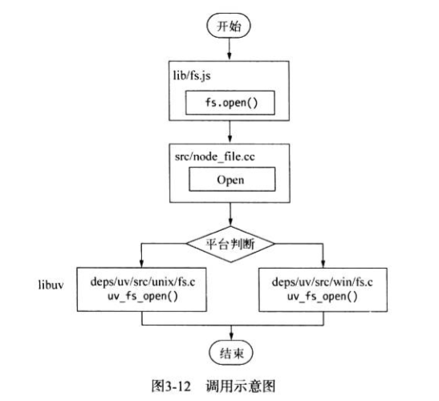
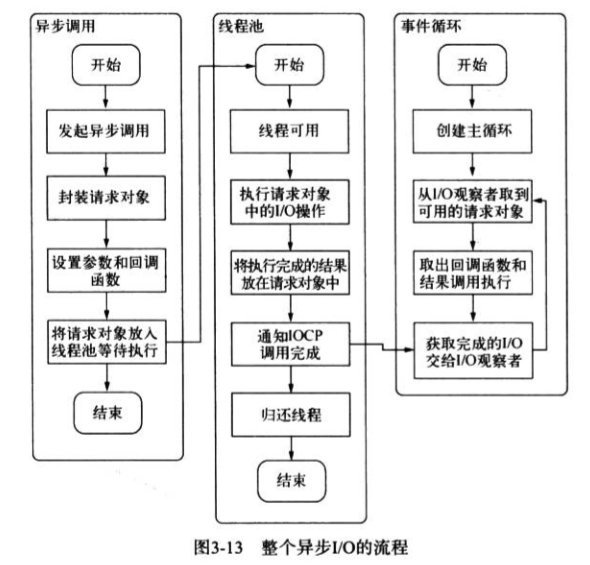
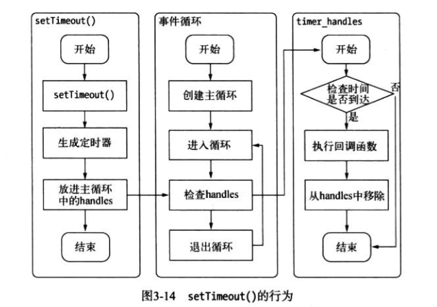

非阻塞需要轮询去确认异步调用是否完成

Node的异步I/O处理执行模型：事件循环
在进程启动时，Node就会创建一个类似于while(true)的循环，每执行一次循环体的过程叫做Tick
每个Tick的过程就是查看是否由事件待处理，如果有则取出事件及其相关的回调函数并执行
如果不再有事件处理，就退出进程

循环在Windows下给予IOCP创建，而在*nix下则给予多线程创建
Window下调用异步I/O的例子:fs.open

首先是JavaScript调用模块，模块调用C++内建模块，内建模块通过libuv进行系统调用，调用uv_fs_open方法，创建带有传入参数和回调函数的FSReqWrap对象，用QueueUserWorkItem()方法将此对象推入线程池中等待执行
线程池中的I/O操作调用完毕之后，会将获取的结果存储在req->result属性上，然后调用PostQueuedCompletionStatus()通知IOCP，告知当前对象操作已经完成，然后Tick会调用ICOP相关的GetQueueCompletionStatus()方法检查线程池中是否有执行完的请求，如果存在，会将请求对象加入到I/O观察者队列中，然后将其当作事件处理

非I/O的异步API
setTimeout()、setInterval()、setImmediate()、process.nextTick()
setTimeout和setInterval调用时创建的定时器会被插入到定时器观察者内部的一个红黑树中
每次Tick执行时，会从该红黑树中迭代去除定时器对象，检查是否查过定时时间，如果超过就形成一个事件，它的回调函数将立即执行

process.nextTick()
会将回调函数放入数组中，在下次Tick时取出所有回调函数执行完

setImmediate()
会将回调函数保存，下次Tick执行完所有函数
process.nextTick(function () {
    console.log('nextTick执行')
})
setImmediate(function () {
    console.log('setImmediate执行')
})
console.log('正常执行')
结果
正常执行
nextTick执行
setImmediate执行

可以看出process.nextTick()中的回调函数执行的优先级要高于setImmediate()，这里的原因是事件循环对观察者的检查是有先后顺序的
process.nextTick()属于idle观察者，setImmediate()属于check观察者
在每一轮循环检查中，idle观察者先于I/O观察者，I/O观察者先于check观察者
