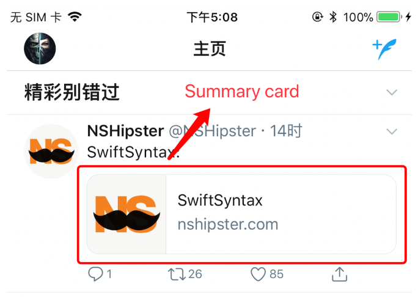

国行手机在ios中浏览器点击分享页面到facebook或twitter是没有反应的   
想让自己的网页能够在分享到facebook或者twitter中被识别为卡片形式,如下图

国外的分享配置一般是采用OG协议   
### OG协议
#### 概念
og协议是facebook编写的元数据协议，全称Open Graph协议，旨在为网站提供更丰富的元数据   
### 使用
网页需要被识别为图像对象，需要我们在页面中添加基本元数据，每个页面必须的四个属性为
```
<meta property="og:title" content="The Rock" />
<meta property="og:type" content="video.movie" />
<meta property="og:url" content="http://www.imdb.com/title/tt0117500/" />
<meta property="og:image" content="http://ia.media-imdb.com/images/rock.jpg" />
```  
如果没有og:url的话，一般系统默认识别为当前页面的url
#### 将网页转换为图形对象
通过在head中添加相应的meta头部，社交平台在用户将页面分享到平台之后可以抓取其中的meta信息，然后以卡片的形式显示出来
webp格式的图片无法在真机中被twitter抓取识别
[facebook分享调试器](https://developers.facebook.com/tools/debug/og/object/)
[twitter分享调试器](https://cards-dev.twitter.com/validator)

Robot.txt
在这个文件中声明该网站中不想被蜘蛛访问的部分，这样，该网站的部分或全部内容就可以不被搜索引擎访问和收录了，或者可以通过robots.txt指定使搜索引擎只收录指定的内容。

Facebook和Twitter卡片信息的抓取都是以爬虫的形式来抓取的，都遵循robot.txt的限制
常见配置：
例1、禁止所有搜索引擎访问网站的任何部分
User-agent: *
Disallow: /
例2、允许所有的robot访问
User-agent: *
Disallow:
（或者也可以建一个空文件 "/robots.txt" file）
例3、禁止某个搜索引擎的访问
User-agent: BadBot
Disallow: /

查看当前服务器的robot.txt
国外地址：https://technicalseo.com/tools/robots-txt/
国内地址：https://ziyuan.baidu.com/robots/index

OG协议
Open Graph Protocol
Facebook发布的用来标注页面的类型和描述页面的内容协议

<meta property="og:title" content="Introducing our New Site" /> 
<meta property="og:image" content="https://scontent-sea1-1.xx.fbcdn.net/hphotos-xap1/t39.2178-6/851565_496755187057665_544240989_n.jpg" /> 
<meta property="og:description" content="http://samples.ogp.me/390580850990722" />

Tips:
设置缩略图的时候大小、格式都会有所限制
Webp格式无法显示
图片要用绝对路径

Twitter缓存
对于网页的信息抓取，twitter会将抓取的信息保存一周
需要用上述的调试工具强制刷新缓存

Twitter分享调试器
开发者文档https://developer.twitter.com/en/docs/tweets/optimize-with-cards/overview/summary
调试工具https://cards-dev.twitter.com/validator

Facebook分享
开发者文档https://developers.facebook.com/docs/sharing/opengraph/using-objects
调试工具https://developers.facebook.com/tools/debug/og/object/