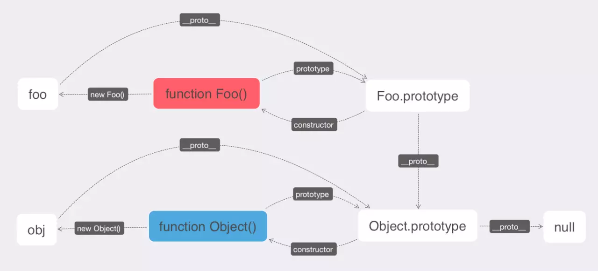
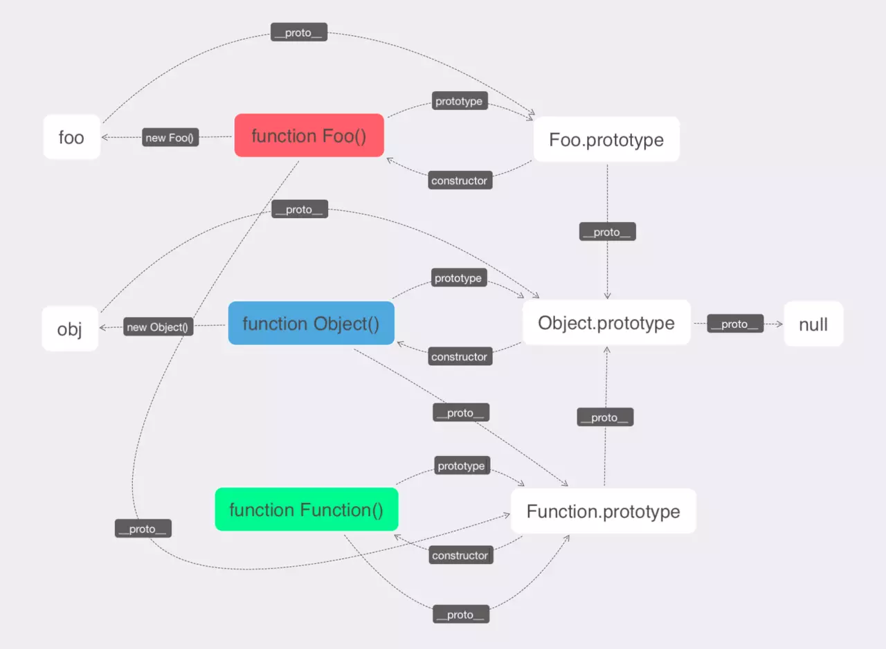

function People(name, age){
this.name = name;
this.age = age;
}
People.prototype.setName = function(name){
this.name = name;
}

new p1 = new People('xiaoming', 21);

People.prototype.constructor == People;//true
p1.__proto__  == People.prototype

prototype和__proto__的区别
__proto__属性指向谁
1、字面量2、构造器3、Object.create()
原型链是什么
__prototype__的尽头是null
console.log(Object.prototype.__proto__ === null) // true

   
   