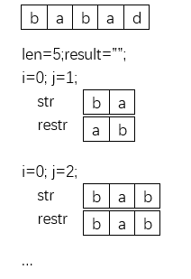
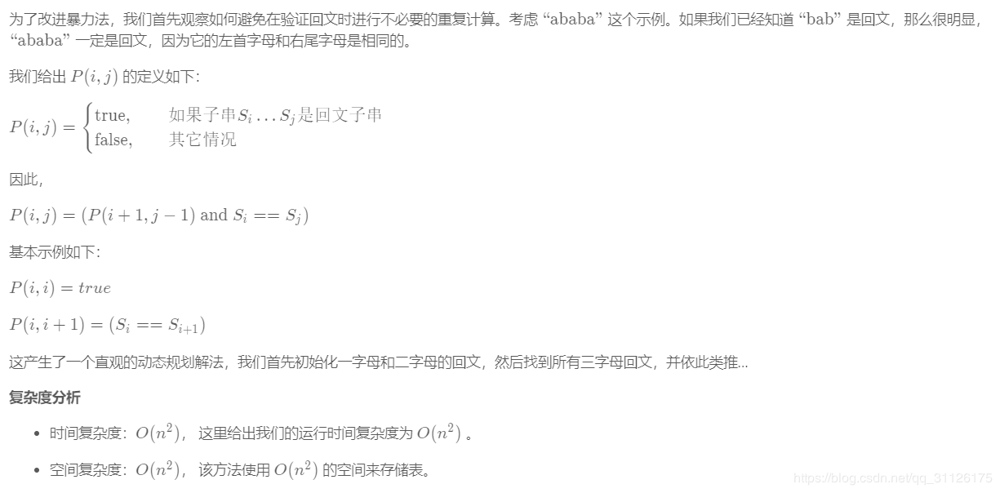
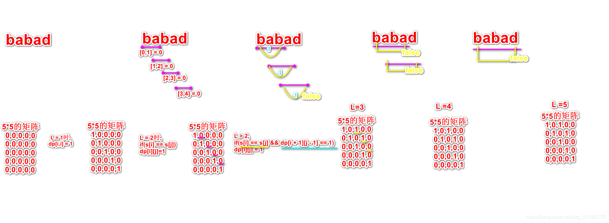

# 最长回文子串
**暴力破解法**   
选出所有子字符串可能的开始和结束位置，并检验它是不是回文，时间复杂度为O(n^ 3)，空间复杂度为O(n^ 3)
```
var longestPalindrome = function (s) {
    var len = s.length;
    if(len == 0){
        return "";
    }
    let result = s[0];//1个字符也是回文子串
    for(let i=0; i<len; i++){
        for(let j=i+1; j<len; j++){
            let str = s.slice(i, j);
            let restr = str.split('').reverse().join('');
            if(str == restr){
                result = str.length > result.length? str: result;
            }
        }
    }
    return result;
};
```
   
**动态规划**   
   
```
var longestPalindrome = function (s) {
    let len = s.length;
    let result;
    let dp = Array(len).fill(0).map(x=>Array(len).fill(0));
    let i,j,L;
    if(len<=1){
        return s;
    }
    //只有一个字符串的时候是回文
    for(i=0; i<len; i++){
        dp[i][i] = 1;
        result = s[i];
    }
    for(L = 2; L<=len; L++){
        //L为当前所判断的字符串的长度,i是第一个字符的index,j是最后一个字符的index
        for(i = 0; i<=len-L; i++){
            //L = j - i + 1
            j = L + i - 1;
            //如果当前判断字串符长度为2
            if(L == 2 && s[i] == s[j]){
                dp[i][j] = 1;
                result = s.slice(i,i+L);
            }
            //当前判断的字符长度不为2
            //s[i] == s[j]判断第一个字符串和第二个字符串是否相同
            //dp[i+1][j-1] == 1判断相关子串是否回文
            //当前字符串长度为L，则需要判断字符串长度为L-2,首字符index为i+1,尾字符index为j-1的子串是否为回文
            else if(s[i] == s[j] && dp[i+1][j-1] == 1){
                dp[i][j] = 1;
                result = s.slice(i,i+L);
            }
        }
    }
    return result;
}
```
   
**自己想的算法**   
大概的想法就是先把字符串变成长度为奇数，在字符间加上#，然后以每一个字符为中心，向左右扩散判断是否是回文子串
```
var longestPalindrome = function (s) {
    var i = 0, pre, next;
        if (s.length < 2) {
            return s;
        }
        s = s.split('').join('#');
        var len = s.length;
        var result = s[len - 1];
        while (i < len) {
            for (pre = i - 1, next = i + 1; s[pre] == s[next] && s[pre] && s[next]; pre-- , next++) {
                if (next - pre + 1 > result.length) {
                    result = s.slice(pre, next + 1);
                }else if(next - pre + 1 == result.length && s[i] == '#'){
                    result = s.slice(pre, next + 1);
                }
            }
            i++;
        }
    return result.split('#').join('');
};
```
**马拉车算法**   
loading...   
参考链接：[https://blog.csdn.net/qq_31126175/article/details/84848290](https://blog.csdn.net/qq_31126175/article/details/84848290)